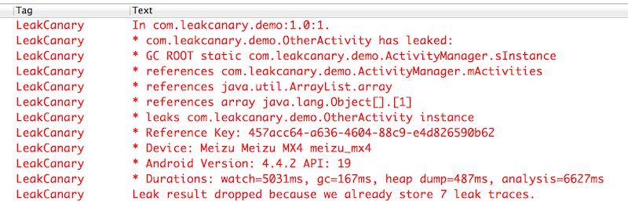

# LeakCanary For Eclipse
该项目是从[LeakCanary](https://github.com/square/leakcanary)移植到Eclipse的实现版,原始代码是从[这里](http://vjson.com/wordpress/leakcanary%E8%AE%A9android%E5%86%85%E5%AD%98%E6%B3%84%E6%BC%8F%E6%97%A0%E5%A4%84%E9%81%81%E5%BD%A2.html)获得,并进行了一些修改。用了这个项目就可以很方便的找到内存泄漏问题啦，摆脱难用的MAT吧！

## 使用

1. 将leakcanary-lib导入eclipse;
2. 你的项目引用leakcanary工程;
3. 在AndroidManifest.xml中添加如下:

```xml
<!-- 写权限-->
<uses-permission android:name="android.permission.WRITE_EXTERNAL_STORAGE" />

<!-- 相关的服务与Activity  -->
<activity android:name="com.squareup.leakcanary.internal.DisplayLeakActivity"
            android:enabled="false"
            android:icon="@drawable/__leak_canary_icon"
            android:label="@string/__leak_canary_display_activity_label"
            android:taskAffinity="com.squareup.leakcanary"
            android:theme="@style/__LeakCanary.Base" >
        </activity>

<service
android:name="com.squareup.leakcanary.internal.HeapAnalyzerService"
        android:enabled="false"
        android:process=":leakcanary" />
<service
       android:name="com.squareup.leakcanary.DisplayLeakService"
       android:enabled="false" />
``` 
4. 创建一个Application子类,并且将它设置为应用的Application

```java
public class MyApplication extends Application {
    private RefWatcher mRefWatcher;

    @Override
    public void onCreate() {
        super.onCreate();

        mRefWatcher = LeakCanaryWrapper.install(this, BuildConfig.DEBUG);
    }

    public RefWatcher getRefWatcher() {
        return mRefWatcher;
    }
}
```

然后在AndroidManifest.xml中设置application: 

```xml
    <application
        android:name="com.leakcanary.demo.MyApplication"
        android:allowBackup="true"
        android:icon="@drawable/ic_launcher"
        android:label="@string/app_name"
        android:theme="@style/AppTheme" >
        // 省略
    </application/>
```
5. 运行程序即可检测内存泄漏。

如果发生内存泄漏，那么则会在Log中输入相关错误信息: 



上述信息很全面，第一行表示在`com.leakcanary.demo`中发生内存泄漏，泄漏的对象是`com.leakcanary.demo.OtherActivity`,只有它的是`com.leakcanary.demo.ActivityManager.sInstance`对象。

其他使用均与LeakCanary相似，可查看LeakCanary的相关资料。
